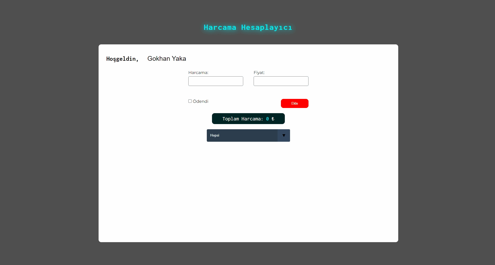

<h1>JavaScript Expenses Tracker</h1>

A simple JavaScript app which you can calculate your expenses

<h2>Techniques used for this project</h2>

Used plain HTML for structuring the page, with CSS styled it and gave it some animation. For the dynamic part i used JavaScript

<h2> Screen gif of final result</h2>

